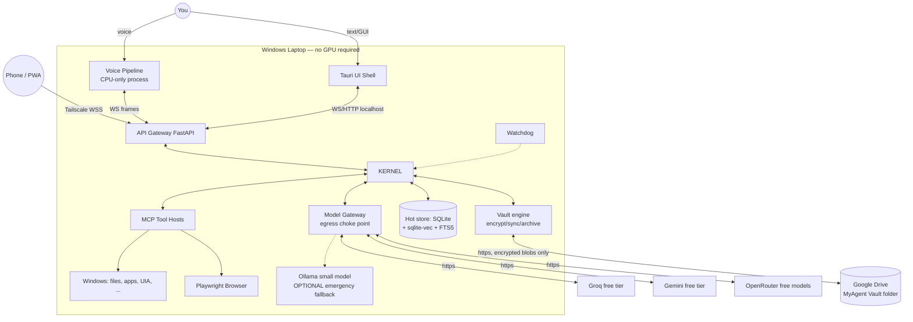
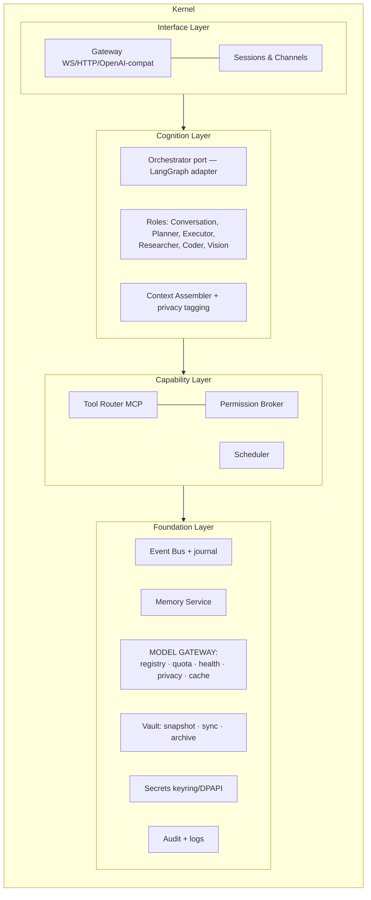
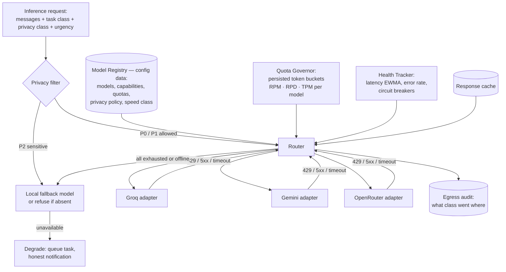
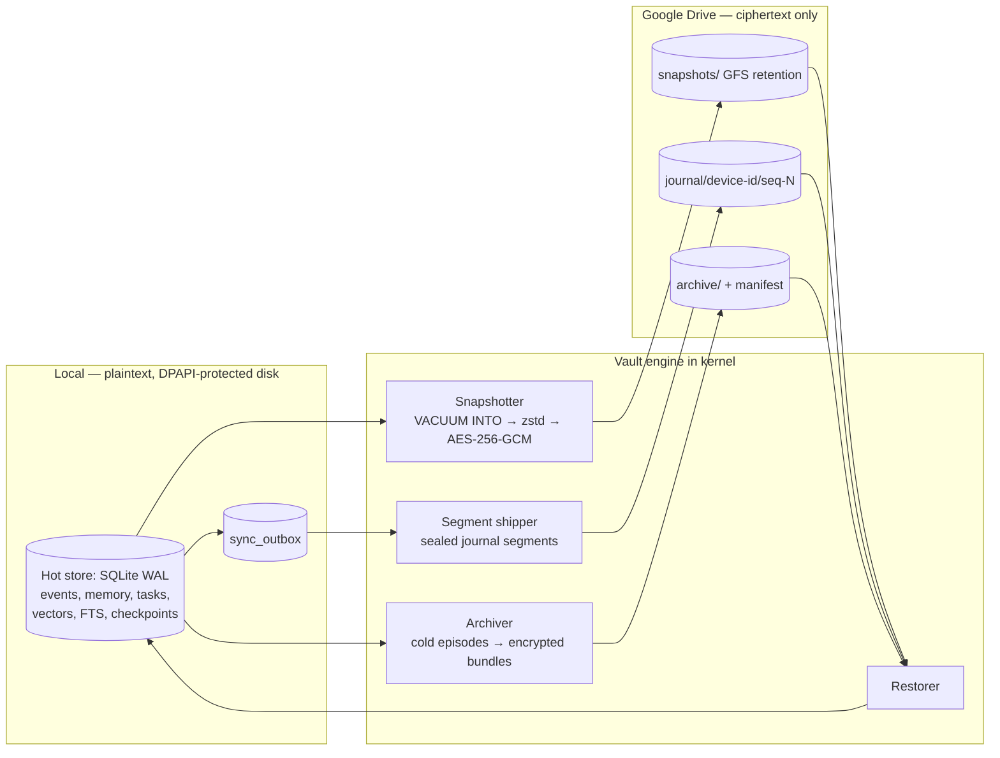

# Phase 3 — System Architecture (rev 2: cloud-first reasoning, Drive vault)

> **Rev 2 (2026-08):** reasoning layer redesigned around free cloud APIs (Gemini, Groq,
> OpenRouter) with local LLMs demoted to emergency fallback; storage redesigned as
> hot SQLite + encrypted Google Drive vault (backup / sync / archive). Local resource
> usage is now a hard budget: **no GPU required, kernel idle ≤ 300 MB RAM.**

## 0. Shape of the system, and why

**Unchanged: a modular-monolith kernel + satellite processes.** The cloud-first pivot
does not change the process shape — it changes what the Model Gateway talks to and adds
one subsystem (the Vault). If anything, the modular monolith matters *more* now: with
inference off-box, the kernel is light enough to run on any laptop, and the only latency
we control is our own — so we keep everything in-proc except audio, UI, and sandboxing.

Two new architectural invariants introduced by this revision:

1. **The Model Gateway is the only egress point for user data.** No module, tool, or
   plugin may call an LLM provider directly. One choke point = one place to enforce
   privacy classes, quota, failover, audit of what left the device, and provider swaps.
2. **Nothing leaves the device unencrypted except inference prompts.** The Drive vault
   stores only client-side-encrypted blobs; Google never sees plaintext. Prompts sent
   to providers are the sole (visible, classified, audited) exception.

## 1. Context diagram

## 2. Kernel: layered internals

Layers and the downward-only dependency rule are unchanged from rev 1. Foundation-layer
changes: the **Model Gateway** grows from a LiteLLM wrapper into a routing subsystem
(§6), and a **Vault engine** joins the foundation (§7).

## 3. The event bus — spine of everything (unchanged, one addition)

Same append-only journal design as rev 1 (audit, replay, recovery, UI updates,
learning data). **Addition:** the journal is now also the **synchronization unit** —
sealed journal segments are what the Vault ships to Drive for multi-device sync (§7.3).
This is why we do *not* sync the SQLite file itself: append-only per-device streams
merge without conflicts; a synced binary DB file corrupts.

New event types: `InferenceRouted`, `ProviderDegraded`, `QuotaExhausted`,
`VaultSnapshotCreated`, `VaultSegmentUploaded`, `ArchiveTierMoved`, `RestoreCompleted`.

## 4. Cognition: the agent loop (unchanged)

The Understand → Plan → Execute → Observe → Replan graph, bounded budgets, LangGraph
interrupts as permission gates — all unchanged from rev 1. What changed underneath:
each graph node's model call now carries a **task class** and inherits the turn's
**privacy class**, which the Model Gateway uses for routing (§6.2). Checkpoint
persistence (SQLite) is unchanged and remains local-only.

## 5. Memory architecture (unchanged model, two implementation changes)

The four-layer model (working / episodic / semantic / procedural), consolidation job,
memory tools, and hybrid retrieval are unchanged. Two changes:

1. **Embeddings stay local — deliberately.** Reasoning went to the cloud; embeddings
   did not. Every memory write and every retrieval would otherwise (a) burn API quota
   at high frequency and (b) stream your entire memory content to a third party.
   fastembed (ONNX, CPU, ~200 MB lazy-loaded) costs nothing and keeps memory private.
2. **Episodic memory gets a cold tier.** Episodes older than the hot window (default
   12 months) migrate to encrypted archive segments on Drive (§7.4); the hot DB keeps
   summaries + embeddings as stubs so retrieval can still *find* them and offer to
   rehydrate. This caps local DB size — part of the minimal-footprint budget.

## 6. Model Gateway v2 — cloud-first inference

The heart of this revision. Requirements it owns: provider-agnostic interface
(FR-LLM-01), quota-aware routing (02), failover (03), task-class routing (04),
privacy classes (05), local emergency fallback (06), caching (07).

### 6.1 Structure

- **Adapters** normalize providers to one interface (LiteLLM does the wire-format
  work; our own `InferenceProvider` port wraps it so even LiteLLM is swappable).
  Adding a provider = a registry entry + API key. **Zero application-code change** —
  cognition only ever sees `complete(request) -> stream`.
- **Model Registry is data, not code** (`config/providers.yaml`): per model —
  capabilities (tool-calling quality, JSON mode, vision, context length), speed class,
  free-tier quota (RPM/RPD/TPM), and privacy policy (`trains_on_data: true/false`).
  Free-tier limits change monthly; a config edit tracks them, no release needed.
- **Quota Governor**: local token buckets per provider×model, persisted in SQLite so
  daily (RPD) counts survive restarts. Routing is **preemptive** — a model with an
  empty bucket is never attempted, so we fail over *before* the 429, not after it.
  Background work (consolidation, research, batch) may not draw a bucket below a
  reserved interactive headroom (default 30 %), so a big research job can never make
  the assistant mute for the rest of the day.
- **Health Tracker**: rolling error rate + latency EWMA per provider; circuit opens
  after K consecutive failures, half-open probe after cooldown. Provider outages
  become `ProviderDegraded` events (visible in dev mode) instead of user-facing errors.
- **Cascade & hedging**: router emits a ranked candidate list; on failure it walks down
  it. For interactive turns, an optional **hedge**: if no first token within ~1.5× the
  provider's p50 TTFT, fire the #2 candidate in parallel and take the first responder
  (spends extra quota — only allowed when buckets are healthy).
- **Cache**: exact-match cache (hash of normalized request) — mainly saves quota on
  deterministic background prompts (consolidation templates, classification calls).

### 6.2 Routing policy (registry data — illustrative defaults, mid-2026)

> **Rev 2.1 (2026-08):** the local model was promoted from "emergency
> fallback" to a first-class routing tier. A complexity classifier
> (`core/complexity.py`, no model call) sends easy turns to an on-device
> qwen2.5-3b; unusable answers are automatically retried on the cloud. This
> costs zero tokens for the majority of everyday turns, makes `local_only`
> prompts answerable instead of refused, and keeps the assistant working when
> free tiers are exhausted. A deterministic pattern layer
> (`core/fastpath.py`) sits in front of both and answers mechanical commands
> with no model at all.

| Task class | Primary | Secondary | Tertiary | Emergency |
|---|---|---|---|---|
| Simple (classifier-selected) | **local qwen2.5-3b** | Groq small | Gemini Flash-Lite | — |
| Triage / acknowledgments (latency-critical) | Groq (small fast model) | Gemini Flash-Lite | OpenRouter free small | local 4B |
| Conversation | Groq 70B-class | Gemini Flash | OpenRouter free 70B-class | local |
| Planning & tool calls (needs best function-calling) | Gemini Flash | Groq 70B-class | OpenRouter free | local |
| Long context (docs, big transcripts) | Gemini Flash (1M ctx) | OpenRouter free long-ctx | — | chunked local |
| Vision / screen understanding | Gemini Flash (multimodal) | OpenRouter free VLM | local moondream (optional extra) | OCR-only answer |
| Background / batch | whichever has most RPD headroom | … | … | queue for later |

Rationale for the spread: **Groq** = lowest TTFT + fastest tokens/sec (the "feels
instant" provider for voice); **Gemini free tier** = largest daily quotas, best free
function calling, 1M context, and vision — the workhorse; **OpenRouter free pool** =
breadth and redundancy across many hosts. Three independent providers is the
availability strategy: the odds of all three throttling simultaneously are low, and
the local fallback catches even that (NFR target: 99.5 % interactive availability).

### 6.3 Privacy classes — the honest cost of free tiers

Free tiers are generally free *because* prompts may be used for training. A personal
assistant streams your life through its prompts, so this is a first-class design axis,
not a footnote:

| Class | Content | Policy |
|---|---|---|
| **P0 — generic** | general questions, public web content, code without secrets | any provider |
| **P1 — personal context** | prompts containing memory about you, file names, schedules | allowed providers per your explicit config; default = allowed after one-time informed consent; optional redaction pass (names/paths → placeholders) |
| **P2 — sensitive** | secrets, credentials, financial/health/identity data, anything the user marks private | **never leaves the device**: local model or the assistant says it can't do this in cloud mode |

The Context Assembler tags every prompt section with its class (memory items carry a
class at write time; tool outputs inherit source class; secrets are pattern-scanned as
a backstop). The prompt's class = max of its sections. Enforcement lives in the
gateway — below cognition, unbypassable, same philosophy as the Permission Broker.
The egress audit records, per provider, what classes flowed there — inspectable in
the memory viewer ("what has Google seen?").

## 7. Storage architecture — hot SQLite + encrypted Drive vault

Three planes, one engine:

### 7.1 Hot store (unchanged role, capped size)
SQLite WAL remains the single operational truth: journal, messages, memory + vectors
(sqlite-vec) + FTS5, tasks, schedules, grants, audit chain, LangGraph checkpoints,
plus new tables: `quota_buckets`, `provider_health`, `llm_cache`, `sync_outbox`,
`vault_manifest`. Archive tiering (7.4) keeps it a few GB at most, forever.

### 7.2 Backup: snapshots
- `VACUUM INTO` produces a consistent point-in-time copy without blocking writers →
  zstd compress → AES-256-GCM encrypt → upload as one blob.
- Schedule: daily + on-demand + before every schema migration. Retention on Drive
  (GFS): 14 daily, 8 weekly, 12 monthly — a few GB total against Drive's free 15 GB.
- Integrity: every snapshot's hash recorded in the local `vault_manifest` *and* in the next
  snapshot (chain), so tampering or silent corruption is detectable at restore time.

### 7.3 Synchronization: journal segments, not database files
- The event journal is written in **segments** (size- or time-bounded). A sealed
  segment is immutable → outbox → encrypted → uploaded to `journal/<device_id>/seq-N`.
- Each device owns its stream (single-writer), so merging is conflict-free by
  construction: a device folds *other* devices' segments into its state in
  (device, sequence) order with Lamport timestamps for cross-stream ordering of
  derived-state edits (last-writer-wins only for explicit user edits of the same
  memory item — surfaced in the memory viewer when it happens, never silent).
- Derived state (semantic memory, task status) is a deterministic fold over events —
  the same code path as crash recovery. Sync = recovery from a remote source. One
  mechanism, tested constantly.
- Offline is a non-event: outbox accumulates, drains when connectivity returns.
  Polling via the Drive changes API (cheap cursor-based `changes.list`).

### 7.4 Archive: long-term cold tier
- Episodes, raw transcripts, and audit segments older than the hot window are bundled
  (zstd JSONL + manifest), encrypted, uploaded, and deleted from the hot store —
  leaving summary + embedding stubs so search still surfaces them ("this is in the
  archive — want me to fetch it?"). Rehydration is one blob download.

### 7.5 Keys, scopes, and trust
- **Encryption key**: 256-bit, generated locally, held in Windows Credential Manager
  (DPAPI). A one-time **recovery phrase** (word-encoded key) is shown at setup for the
  user to store outside the machine — lose both machine and phrase = vault is
  unrecoverable, by design. The key never touches Drive.
- **OAuth**: `drive.file` scope only — the vault can touch *only files it created*;
  the assistant never gets blanket Drive access for backups. (A future user-facing
  "manage my Drive" plugin is a separate MCP server with its own scope and its own
  permission-tier grant — trust boundaries don't blur.)
- **Restore drill** (tested in CI against a scratch Drive folder, and required in
  M2's exit criteria): fresh machine → sign in → enter recovery phrase → download
  snapshot + newer segments → replay → identical assistant.
- Vendor lock-in guard: the vault engine writes through a `RemoteVault` port with a
  Drive adapter; OneDrive/S3/WebDAV adapters are drop-ins later. Blob formats are
  provider-agnostic (documented, versioned, open).

## 8. Voice pipeline — CPU-only budget

Same pipeline shape as rev 1 (sounddevice → Silero VAD → openWakeWord →
faster-whisper → kernel → Kokoro/Piper → speaker; barge-in; mode switching). Changes:

- **STT**: faster-whisper `distil-small.en` / `base` int8 on CPU — the always-on
  streaming path. Optional accuracy assist: Groq's hosted Whisper endpoint (free tier)
  re-transcribes *finished* long dictations in the background (P1 privacy class,
  user-enabled); live streaming stays local for latency and availability.
- **TTS**: Kokoro-82M runs fine on CPU; Piper remains the ultra-low-latency fallback.
  No cloud TTS: free tiers with streaming + acceptable latency don't exist reliably.
- **Wake word & VAD: always local, non-negotiable** — an always-open cloud mic is a
  privacy and availability absurdity.
- Net effect: the *conversation brain* is faster (Groq TTFT typically beats a local
  8B on consumer hardware) while the audio edge stays private and offline-capable.
- Resource budget: idle (VAD+wake only) ≤ 150 MB / ~1 % CPU; active STT bursts ~1 GB
  RAM on CPU; models unload after idle timeout.

## 9. Desktop control: hybrid action ladder (unchanged, vision rung updated)

Rungs 1 (native API/CLI) and 2 (UIA) unchanged. **Rung 3 (vision)** now defaults to
Gemini Flash multimodal for screen understanding and element grounding — which removes
the local VLM from the required stack entirely (a huge footprint win). Local
moondream2 remains an *optional extra* for offline/P2 screens. **Privacy note:**
screenshots are inherently P1-by-default and are *never* auto-shipped: rung-3 actions
and "what's on my screen?" require the screen-capture consent grant, and screenshots
containing detected secret patterns (password fields flagged via UIA, credential
patterns via OCR prescan) are forced to P2 = local-only handling or refusal.

## 10. Security architecture (rev 1 model + egress controls)

Everything from rev 1 stands: tiered permissions below cognition, taint tracking with
escalation suspension, hash-chained audit, sandbox, watchdog kill switch, remote-role
restrictions. Additions:

1. **Egress choke point**: only two modules may open outbound connections — the Model
   Gateway (prompts, classified & audited) and the Vault (ciphertext only). Tools and
   plugins get network access solely via the existing per-plugin egress allowlist
   (SEC-11). Dev mode shows a live "what left the device" panel.
2. **OAuth token & API keys** live in Credential Manager, loaded into process memory
   only, never logged, never in prompts (secret-pattern scan is the backstop).
3. **Cloud-provider taint**: inference responses are *model output*, already treated
   as untrusted for permission purposes (they can only act through the broker) — no
   change needed; noted here because "the brain is now remote" doesn't alter the
   security model: the brain was never trusted with direct capability anyway.

## 11. Satellite processes & supervision

| Process | Tech | Change in rev 2 |
|---|---|---|
| Kernel | Python/asyncio | + Model Gateway v2, Vault engine; idle ≤ 300 MB |
| Voice pipeline | Python, **CPU-only** | smaller STT models; no GPU dependency |
| UI shell | Tauri 2 | unchanged |
| Sandbox executor | subprocess pool | unchanged |
| External MCP plugins | any | unchanged |
| Browser | Playwright Chromium | unchanged (launched on demand) |
| Watchdog | tiny process | unchanged |
| ~~Ollama~~ | optional service | **no longer required** — installed only if the user wants the emergency fallback / P2 local handling (strongly recommended, still free) |

## 12. Data model (additions in bold)

`events` · `messages` · `sessions` · `memory_items` · `memory_links` · `tasks` ·
`task_steps` · `schedules` · `grants` · `audit` · `plugins` · `settings` ·
**`quota_buckets`** · **`provider_health`** · **`llm_cache`** · **`sync_outbox`** ·
**`vault_manifest`** · **`archive_stubs`**. Still one SQLite file, WAL mode.

## 13. Requirement traceability (delta)

| Subsystem | Fulfills |
|---|---|
| Model Gateway v2 | FR-LLM-01..08, NFR-AVAIL-01, TC-03 |
| Privacy filter + egress audit | SEC-12, SEC-13, TC-05 |
| Vault engine (snapshot/sync/archive/restore) | FR-SYNC-01..06, NFR-SCAL-01/04 |
| CPU voice pipeline | NFR-PERF-01/03/04 within TC-02 (no GPU) |
| Everything else | unchanged from rev 1 |
