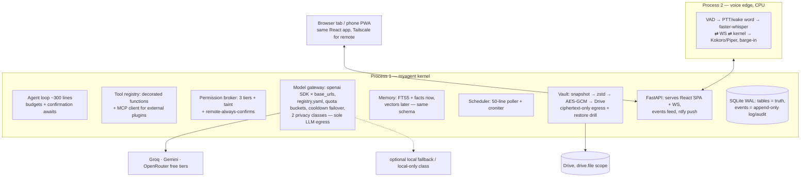

# Independent Architecture Review → Architecture v3

Reviewer stance: hired to find what will prevent a single developer (with Claude Code
writing most code) from *finishing* a high-quality AI assistant. Verdicts are blunt.
The seven review questions (necessary? over-engineered? simplifiable? postponable?
maintenance cost? YAGNI? slows implementation?) are folded into each finding rather
than repeated 15 times.

**Overall verdict:** The v1/v2 architecture is directionally right (local-sovereign
data, rented reasoning, permission broker below cognition, SQLite, MCP for plugins)
but it is **a 3-person-team architecture assigned to 1 person**. It ignores its own
research lesson twice (framework churn → then adopts two frameworks), and roughly
40 % of its surface area serves futures that may never arrive. Below: what dies, what
shrinks, what stays.

---

## Part 1 — Findings

### F1. LangGraph should be deleted. The agent loop must be owned. ⚠ reverses a core decision
- **Current design:** LangGraph behind an `Orchestrator` port; checkpointing and
  interrupt/resume justify it; adapter firewall contains churn.
- **Problem:** The two justifying primitives are trivial *when you own the loop*.
  An "interrupt" in your own loop is `await confirmation_future`. A "checkpoint" is
  the conversation transcript you already persist in SQLite. Meanwhile the research
  doc's own top lesson was *framework churn* — and the design then adopted the
  fastest-churning layer of the stack and built a firewall around it. A firewall
  around something you don't need is still maintenance.
- **Why it matters:** The agent loop is ~200–400 lines of asyncio you'll debug
  weekly. Debugging *through* a framework's graph abstraction is strictly worse than
  debugging your own while-loop. Claude Code itself — the strongest working agent in
  this product category — is a single owned loop with tools, not a graph framework.
- **Better alternative:** One owned loop: `while: model → tool_calls? → broker →
  execute → append results`, with step/token/time budgets and a pluggable
  confirmation await. Sub-agents later = the same loop spawned with a narrower tool
  list (Claude Code's Task pattern), not a framework feature.
- **Impact:** −1 heavy dependency tree, −1 abstraction layer, −the entire
  `langgraph_adapter/` package. The system's hardest-to-debug component becomes its
  most transparent. Days of integration work → one afternoon.

### F2. The agent-role taxonomy is fiction. Delete it.
- **Current design:** Roles: Conversation, Planner, Executor, Researcher, Coder,
  Vision — "prompt+tool configurations executed by graph nodes."
- **Problem:** With 2026 function-calling models, Planner/Executor separation with
  typed plan objects *fights the model*, which plans perfectly well in-context.
  Six roles = six prompts to maintain, six behaviors to tune, zero user-visible value
  over one good system prompt + task-scoped tool lists.
- **Better alternative:** One assistant prompt. "Roles" become, at most, tool-subset
  presets. The Understand→Plan→Execute state diagram collapses into the loop itself;
  plan visibility for the user = the model's stated plan + a live tool-call feed in
  the UI (which the journal already provides).
- **Impact:** Deletes `cognition/roles/`, the plan/step data model, and the
  multi-agent section — while *improving* task performance on modern models.

### F3. Built-in tools as MCP servers is ceremony. Plain functions win.
- **Current design:** Every capability, built-in or external, is an MCP server;
  each `tools/*` runs standalone; in-proc "fast path" for built-ins.
- **Problem:** MCP earns its keep at *trust and process boundaries* (third-party
  plugins). For your own file/shell/window tools, JSON-RPC framing, per-tool
  projects, and lifecycle supervision are pure overhead — and "in-proc fast path"
  is an admission the abstraction was wrong for that case.
- **Better alternative:** Built-in tool = a Python function with a decorator
  declaring name, schema, permission tier. One registry. The MCP *client* mounts
  external servers into the same registry — so the ecosystem benefit survives intact.
- **Impact:** Deletes 8 mini-projects worth of packaging; adding a built-in tool
  drops from "new server" to "one function." MCP remains the plugin story (unchanged).

### F4. The monorepo workspace layout is a 3-team structure. Flatten it.
- **Current design:** uv workspace: `packages/contracts`, `packages/common`,
  `apps/kernel`, `apps/voice`, `apps/watchdog`, `tools/*` (8 packages), `plugins/`,
  `skills/`, import-linter rules.
- **Problem:** Cross-package plumbing (version pins, editable installs, import
  contracts) is friction on *every single change*, and Claude Code works measurably
  better in one coherent package than across workspace seams. `contracts` as a
  separate versioned package matters only when independent deployables consume it —
  there's one deployable.
- **Better alternative:** One `src/myagent/` package (`core/`, `gateway/`, `memory/`,
  `tools/`, `voice/`, `vault/`, `server/`), one `ui/` folder, one `tests/`.
  `contracts.py` is a module. Split into packages the day a real second deployable exists.
- **Impact:** Every future change touches less machinery. Zero architectural options lost.

### F5. Tauri now is a second toolchain before the first one works. Postpone.
- **Current design:** Tauri 2 + React shell with tray, overlay orb, global hotkeys;
  separate PWA for phone.
- **Problem:** Rust toolchain, native packaging, updater, and webview quirks — for
  polish features (orb, tray) that don't gate the product's intelligence. Meanwhile
  the design *already* ships a web UI over Tailscale for the phone; that same UI in
  a desktop browser tab is 95 % of the value at 0 % of the cost.
- **Better alternative:** FastAPI serves the React SPA. Desktop = browser tab/PWA
  window; phone = same URL over Tailscale (remote-access milestone merges into the
  UI for free). `pystray` + a global-hotkey lib cover tray + kill switch + push-to-talk
  interim. Tauri becomes the *polish* milestone when the assistant already works.
- **Impact:** UI stack: 2 apps → 1. Remote access: milestone → property. Weeks saved
  before first daily-driver build.

### F6. LiteLLM is heavier than the problem. Use the OpenAI SDK + base URLs.
- **Current design:** LiteLLM for wire normalization under a custom router.
- **Problem:** All three chosen providers (Groq, Gemini, OpenRouter) expose
  OpenAI-compatible chat-completions endpoints. LiteLLM's value is normalizing *100+*
  providers; we have 3 that already speak one dialect. It's a large, fast-churning
  dependency in the hottest path of the system.
- **Better alternative:** The `openai` SDK with per-provider `base_url` + api_key from
  the registry. Provider quirks (tool-call edge cases) get handled in ~50 lines we own.
  Revisit-trigger: a must-have provider with no OpenAI-compatible surface.
- **Impact:** Hot path becomes fully inspectable; one fewer major dep to track monthly.

### F7. Gateway extras: hedging, semantic-adjacent caching, EWMA circuit breakers — trim to the 20 % that matters.
- **Current design:** Preemptive quota buckets + health tracker (latency EWMA,
  circuit states, half-open probes) + hedged duplicate requests + response cache.
- **Problem:** Quota buckets and failover cascade are the genuinely load-bearing 20 %.
  Hedging doubles quota burn to shave tail latency — on *free tiers*, quota is the
  scarcer resource. EWMA circuit breakers are a distributed-systems reflex; a
  failure-count + cooldown timestamp (10 lines) yields the same behavior at this scale.
  The cache mostly serves the consolidation job, which is itself deferred (F10).
- **Better alternative:** Registry (config) + persisted RPM/RPD buckets + ranked
  cascade + N-failures→cooldown. Nothing else in v1.
- **Impact:** Gateway shrinks from 8 modules to ~4 small files with identical
  user-visible reliability.

### F8. Privacy classes: 3 → 2. Redaction pass: postpone.
- **Current design:** P0 generic / P1 personal-with-consent-matrix (+ optional
  redaction) / P2 never-leaves-device.
- **Problem:** In a personal assistant, *almost every prompt is P1* — memory context
  makes it so. The P0/P1 distinction produces a consent matrix and classification
  logic that changes routing for ~nothing. The redaction pass (entity → placeholder →
  un-redact) is genuinely hard NLP bolted on as a bullet point.
- **Better alternative:** Two classes: **cloud-ok** (default, after one honest
  onboarding disclosure: "free tiers may train on this") and **local-only**
  (secret-pattern hits, credential fields, user-marked items, private mode toggle).
  Enforced at the gateway exactly as designed.
- **Impact:** Same real-world protection (the enforceable line was always "sensitive
  never leaves"), minus a consent-management subsystem.

### F9. The Vault: snapshots are gold; sync and archive are YAGNI today.
- **Current design:** Snapshots (GFS) + per-device journal-segment sync with Lamport
  ordering + cold-tier archive with search stubs and rehydration.
- **Problem:** Multi-device sync serves a second device that won't exist for a year+
  (phone talks to the kernel *live* over Tailscale — it needs no synced replica).
  The archive tier solves "SQLite too big," but a decade of text conversation is
  single-digit GB — SQLite's comfort zone. Both are elegant solutions to absent problems,
  and sync in particular drags event-sourcing discipline (deterministic folds,
  cross-stream ordering) into the core as a permanent tax (see F11).
- **Better alternative:** Ship `VACUUM INTO → zstd → AES-256-GCM → Drive` snapshots
  with simple retention (30 daily / 12 monthly) + the restore drill. Design note in
  the roadmap reserves journal-based sync as the *future* mechanism. Archive: delete
  from the plan.
- **Impact:** Vault: 7 modules → 3. The strongest durability guarantees (backup +
  proven restore + encryption + `drive.file` scope) all survive.

### F10. Memory: right model, premature machinery. Stage it.
- **Current design:** 4 layers + vectors + FTS + consolidation "sleep" job +
  procedural recipes + decay + supersede-links at v1.
- **Problem:** Retrieval quality for a *single user's* history is dominated by
  recency + keyword + explicitly-saved facts for the first several months of data.
  Vector search, consolidation, decay, and procedural memory are tuning layers on a
  corpus that doesn't exist yet; building them first is calibrating on vapor.
- **Better alternative:** Stage 1: transcripts + FTS5 + explicit `remember`/`forget`
  facts injected every turn + recency. Stage 2 (when FTS misses become annoying):
  sqlite-vec + fastembed hybrid. Stage 3 (when real usage data exists): consolidation,
  decay, procedural recipes. Schema anticipates all three (provenance/confidence
  columns exist from day one — columns are cheap, jobs aren't).
- **Impact:** Memory v1: ~2 weeks → ~3 days, with a straight, non-breaking upgrade path.

### F11. Event journal: keep the log, drop the event-sourcing religion.
- **Current design:** Journal as spine; derived state as "deterministic fold over
  events"; sync = recovery = fold; separate hash-chained audit store.
- **Problem:** Full event-sourcing (rebuildable-from-log state) is a discipline tax on
  every feature forever, and its main beneficiary was the deferred sync (F9). The
  hash chain defends against an adversary who owns the machine — who can also rewrite
  the chain. Two logs (journal + audit) for one machine is one log too many.
- **Better alternative:** Normal tables are the truth; the `events` table is an
  append-only *log* (audit = a filtered view of it; UI live-feed = its pub/sub).
  Recovery = WAL + transactions, which SQLite already guarantees.
- **Impact:** Every feature gets simpler to write; audit/replay/debug value fully retained.

### F12. Security: same teeth, less apparatus.
- **Current design:** 4 tiers, per-channel role system, job-object sandbox, separate
  watchdog process, hash chain (see F11), taint tracking.
- **Findings:** Tiers 4→3 (read / reversible-write / confirm-always) — the T2/T3
  distinction produced no different enforcement path. Role system → one rule:
  *remote sessions always confirm writes* (revisit when a second human exists).
  Watchdog process → postpone; a global kill hotkey + tray quit + closing the app
  covers the realistic solo failure mode. Job-object sandbox → postpone behind
  confirm-always shell + path allowlist (matches how Claude Code itself ships).
  **Taint suspension stays — it's ~20 lines and it's the one defense that matters**
  (untrusted content can't silently escalate). Egress-choke-point invariant stays.
- **Impact:** Security milestone shrinks by ~half; the two mechanisms with real
  stopping power (broker + taint) are untouched.

### F13. APScheduler → a 50-line poller.
- **Current design:** APScheduler + SQLAlchemy job store.
- **Problem:** Pulls in SQLAlchemy for a `schedules` table we already own; APScheduler
  4.x has its own churn history. Personal-scale scheduling is `SELECT * FROM schedules
  WHERE next_run <= now` every 30 s.
- **Better alternative:** Own the poller; `croniter` for cron parsing.
- **Impact:** −2 dependencies, full control of retry/misfire semantics.

### F14. Process/document/standards ceremony.
- **Requirements doc:** IDs are fine; the traceability matrices and P0/P1/P2 priority
  bookkeeping will rot by M3 — delete matrices, keep a flat numbered list.
- **Standards doc:** 85 % coverage targets, import-linter, contract round-trip suites,
  promptfoo lane → replace with: ruff + pyright(basic) + pytest with *mandatory tests
  only for broker/gateway/vault* + one scripted eval scenario file. Keep conventional
  commits, ADRs, small-files rule (that one genuinely helps Claude Code).
- **Docs:** 10 documents is a wiki for a team. Collapse to 3 living docs
  (README / ARCHITECTURE / PLAN) + ADRs; mark the rest historical reference.
- **Research doc:** conclusions stand, with one correction — lesson #5 ("framework
  firewall") was applied inconsistently: the correct application was *don't adopt the
  framework* (F1, F6), not *wrap it*.
- **Roadmap:** direction stands; delete the OpenAI-compatible server endpoint
  (FR-PLAT-05) and per-app Adobe skill packs from anything resembling a commitment —
  both are v3+ plugin-era work.
- **Milestones:** 13 → 8, and **voice moves before hands**: the product's identity is
  the companion; voice-with-memory is a zero-capability (hence zero-risk) daily driver
  and the strongest motivation engine available to a solo builder. Hands follow, with
  the permission broker built *in the same milestone* as the first dangerous tool.

---

## Part 2 — Architecture v3

The version I would build today. Same soul (local-sovereign data, rented brains,
physical security boundaries, MCP plugin future), one-third the surface area.

### Shape: 2 processes + a browser tab

### What each v2 subsystem became
| v2 | v3 |
|---|---|
| LangGraph + Orchestrator port + roles | Owned ~300-line loop, one system prompt, tool-subset presets |
| MCP-everything | Decorated Python functions + MCP client for third-party plugins |
| LiteLLM + 8-module gateway | openai SDK × 3 base URLs + registry.yaml + buckets + cooldowns |
| P0/P1/P2 + consent matrix + redaction | cloud-ok vs local-only + one onboarding disclosure |
| Vault: snapshot + sync + archive | Snapshot + restore drill only (sync reserved in roadmap) |
| 4-layer memory + consolidation at v1 | FTS + facts now; vectors, then consolidation, staged by need |
| Event-sourced state + hash-chained audit | Tables = truth; one append-only events log = audit + feed |
| 4 tiers + roles + watchdog + job objects | 3 tiers + taint + remote-confirms + kill hotkey; sandbox later |
| Tauri + separate PWA | One React SPA served by FastAPI (desktop tab + phone); Tauri = polish milestone |
| uv workspace, 15+ packages | One package: `src/myagent/` + `ui/` + `tests/` |
| APScheduler | Poller + croniter |
| 13 milestones | 8 milestones, voice before hands |

### Unchanged, deliberately (the load-bearing 20 %)
Provider portfolio with **preemptive quota routing**; **permission broker below
cognition**; **taint escalation suspension**; **egress limited to gateway (classified)
+ vault (ciphertext)**; SQLite WAL + `drive.file`-scoped encrypted backups with a
**proven restore**; local voice edge (VAD/wake/STT/TTS never cloud-streamed);
local embeddings when vectors arrive; Playwright + UIA-over-pixels ladder; Tailscale
+ ntfy; secrets in Credential Manager.

### v3 milestones (each a daily driver)
| # | Ships | Notes |
|---|---|---|
| 1 | **Core brain**: loop, gateway (3 providers, failover, buckets), SQLite persistence, web chat UI + streaming | provider-kill test is the exit gate |
| 2 | **Memory + backup**: FTS retrieval, remember/forget, memory view; Drive snapshots + restore drill | backup before any write capability |
| 3 | **Voice**: PTT first, then wake word; streaming STT/TTS; barge-in | zero-capability = zero-risk companion |
| 4 | **Hands + broker**: files/shell/app-launch behind 3-tier broker, taint, kill hotkey, audit view | security and capability in one milestone, inseparable |
| 5 | **Web + time**: Playwright browsing/research; scheduler; ntfy + toasts; morning briefing | taint rules get real work |
| 6 | **Remote**: Tailscale exposure of the same UI, remote-confirms policy | mostly config, small milestone |
| 7 | **Desktop depth**: UIA control, screenshot understanding (Gemini, consent-gated), clipboard, monitors | the ladder, rungs 2–3 |
| 8 | **Ecosystem + polish**: external MCP plugins, vectors/consolidation if earned, Tauri shell + orb, local fallback model | the "OS" era begins |

### Growth path to the AI OS (why v3 doesn't cap the dream)
Every deferred item re-enters through a seam that v3 keeps open: plugins via the MCP
client; sync via the events log + vault; sub-agents via loop-spawning; cross-platform
via the tools layer; Tauri via the already-web UI; Postgres via the repo layer;
paid or local-frontier models via `registry.yaml`. Deferral ≠ deletion of the option —
it's deletion of the *carrying cost* until the option is exercised.

### The one-sentence review
v2 designed the correct *destination*; v3 deletes everything that was built for
passengers who haven't boarded yet — and that is what makes arrival probable.
