# MyAgent — Implementation Playbook (single source of truth)

Built on **Architecture v3** ([10-review-v3.md](10-review-v3.md)). This document is
authoritative for implementation. If any other doc disagrees, this wins.

## How to use this document
- Build milestones **in order**. Each ends with a **running app you use daily**.
- Within a milestone, create files **in the listed order** — the order is the
  dependency order, so nothing imports something that doesn't exist yet.
- Do not start milestone N+1 until milestone N's **validation checklist** is 100 % green.
- "Public API" = called from *other subsystems*. "Internal API" = private to that module.
- Claude Code writes most code; the **Common Mistakes** sections are written *at* it.

## Global conventions (apply to every milestone)
- One package: `src/myagent/`. One UI: `ui/`. One test root: `tests/`.
- Python 3.12, `uv` for deps, `ruff` + `pyright (basic)` clean before any commit.
- Every module ≤ ~400 lines. Split by responsibility, not by line count panic.
- All config in `config/*.yaml`; all secrets in Windows Credential Manager via `keyring`.
- SQLite WAL, one file at `%LOCALAPPDATA%/MyAgent/myagent.db`. Migrations are numbered
  SQL files, applied in order, never edited after commit.
- Every DB write that matters also appends one row to `events` (the log = audit + UI feed).
- Conventional Commits. One ADR per irreversible decision.

## Milestone map
| # | Name | Daily-driver capability | Gate |
|---|---|---|---|
| 0 | Skeleton | `myagent` boots, logs, DB opens, tests run | CI green |
| 1 | Core brain | Streaming chat via 3-provider gateway with failover | Provider-kill test |
| 2 | Memory + backup | Remembers you; encrypted Drive backup + proven restore | Restore drill |
| 3 | Voice | Talk to it (PTT → wake word), barge-in | Latency budgets |
| 4 | Hands + broker | Files/shell/app-launch behind permission broker | Red-team checklist |
| 5 | Web + time | Browsing/research + scheduled tasks + notifications | Taint + schedule tests |
| 6 | Remote | Same UI from phone over Tailscale, remote-confirms | Remote policy test |
| 7 | Desktop depth | UIA control + screen understanding | Ladder tests |
| 8 | Ecosystem + polish | External MCP plugins, vectors, Tauri, local fallback | Plugin + eval tests |

---

# Milestone 0 — Skeleton

**Goal.** A runnable, testable empty shell: `myagent` starts, loads config, opens the
DB, writes a structured log line, exposes `GET /health`, and CI runs the test suite.

**Why before M1.** Every later module imports config, logging, the DB connection, and
the event log. Building the brain on top of an unproven boot sequence means debugging
two things at once. This milestone makes "does it start?" never a question again.

**Files to create, in order.**
1. `pyproject.toml` — package metadata, deps (`fastapi`, `uvicorn`, `openai`, `pydantic`, `structlog`, `keyring`, `pyyaml`, `pytest`, `ruff`, `pyright`), scripts.
2. `.gitignore`, `.env.example`, `README.md` pointer to this playbook.
3. `config/default.yaml` — empty-ish: paths, log level, feature flags.
4. `src/myagent/__init__.py` — version string only.
5. `src/myagent/config.py` — load YAML + env overrides into a typed `Settings` (Pydantic).
6. `src/myagent/logging.py` — structlog JSON setup; `get_logger(name)`.
7. `src/myagent/db.py` — open SQLite (WAL, `busy_timeout`), run migrations, expose `connection()` / `transaction()` context managers.
8. `src/myagent/migrations/0001_init.sql` — `events` table + `schema_version`.
9. `src/myagent/events.py` — `append_event(conn, type, data, trace_id)`; `EventType` enum.
10. `src/myagent/server/app.py` — FastAPI app factory, `GET /health`.
11. `src/myagent/__main__.py` — wire config→logging→db→server; `python -m myagent`.
12. `Justfile` — `dev`, `test`, `lint`, `typecheck`.
13. `tests/test_boot.py`, `tests/test_db.py`, `tests/conftest.py` (tmp DB fixture).
14. `.github/workflows/ci.yml` — lint + typecheck + pytest.

**Expected structure after M0.**
```
my-agent/
├── pyproject.toml  Justfile  .env.example  .gitignore  README.md
├── config/default.yaml
├── src/myagent/
│   ├── __init__.py  __main__.py  config.py  logging.py  db.py  events.py
│   ├── migrations/0001_init.sql
│   └── server/app.py
├── tests/conftest.py  test_boot.py  test_db.py
└── .github/workflows/ci.yml
```

**Public API.** `Settings`, `get_logger()`, `db.connection()/transaction()`,
`append_event()`, `create_app()`.
**Internal API.** Migration runner, YAML loader.

**Database changes.** `schema_version(version INT)`; `events(id, ts, type, trace_id,
data_json)` — indexed on `(ts)` and `(type)`.

**Tests.** Boot returns 200 on `/health`; DB opens in WAL; migration is idempotent
(run twice, one version row); `append_event` round-trips; config env override wins.

**Common mistakes to avoid.**
- Do **not** add a `src/myagent/tools/` or gateway package "to get ahead." M0 is boot only.
- Do not use an ORM. Raw SQL + the migration runner. (SQLAlchemy is banned until proven needed.)
- Do not open a DB connection per query globally; use the context managers.
- WAL mode must be set on every fresh connection, not once.

**Validation checklist.** ☐ `python -m myagent` serves `/health` ☐ `just test` green
☐ `just lint` + `just typecheck` clean ☐ CI green on push ☐ DB file created with WAL
☐ one event row written on boot (`AppStarted`).

---

# Milestone 1 — Core brain

**Goal.** Multi-turn **streaming chat** through the Model Gateway across Groq + Gemini +
OpenRouter, with **preemptive quota routing** and **automatic failover**, persisted
conversation history, and a minimal web chat UI.

**Why before M2.** Memory is worthless without something to converse with, and every
later milestone calls the gateway. The gateway's failover and quota discipline are
foundational — retrofitting them into a single-provider codebase is a rewrite.

**Files to create, in order.**
1. `config/providers.yaml` — the registry: per provider `base_url`, `api_key_ref` (keyring key), and per model: `id`, `task_classes`, `speed`, `rpm`, `rpd`, `tpm`, `context`, `supports_tools`, `supports_vision`, `trains_on_data`. Plus routing tables per task class (ranked list).
2. `migrations/0002_llm.sql` — `messages`, `sessions`, `quota_buckets`, `provider_health`.
3. `src/myagent/gateway/types.py` — `InferenceRequest` (messages, task_class, privacy_class, stream), `InferenceChunk`, `ProviderError`.
4. `src/myagent/gateway/registry.py` — load `providers.yaml`, resolve ranked candidates for a task class.
5. `src/myagent/gateway/quota.py` — persisted token buckets; `can_use(model)`, `record(model, tokens)`; interactive-headroom reservation.
6. `src/myagent/gateway/health.py` — failure counter + cooldown timestamp per provider; `is_available(provider)`, `record_failure/success`.
7. `src/myagent/gateway/client.py` — one `openai` client per provider (base_url + key); `stream(model, messages)`.
8. `src/myagent/gateway/privacy.py` — classify prompt: `cloud_ok` vs `local_only` (secret-pattern scan + explicit flags); pick allowed candidates.
9. `src/myagent/gateway/gateway.py` — **the public face**: `complete(request) -> AsyncIterator[chunk]`. Walks the ranked, quota-checked, health-checked, privacy-filtered candidate list; emits `InferenceRouted` / `ProviderDegraded` events.
10. `src/myagent/core/history.py` — load/save session messages.
11. `src/myagent/core/loop.py` — **M1 version**: no tools yet. `respond(session_id, user_text) -> stream`: assemble messages → `gateway.complete` → stream out → persist.
12. `src/myagent/server/chat.py` — `POST /chat` (SSE stream), `GET /sessions/{id}`, WS endpoint for the UI.
13. `ui/` — minimal React (Vite) SPA: message list + input + streaming; served by FastAPI as static files.
14. `scripts/doctor.py` — checks keys present, pings each provider, prints quota config.
15. Tests (below).

**Expected structure after M1 (additions).**
```
src/myagent/
├── core/{history.py, loop.py}
├── gateway/{types.py, registry.py, quota.py, health.py, client.py, privacy.py, gateway.py}
├── server/{app.py, chat.py}
├── migrations/0002_llm.sql
config/providers.yaml
ui/  (vite react app)
scripts/doctor.py
```

**Public API.** `gateway.complete(request)`; `loop.respond(session_id, text)`;
`/chat`, `/sessions/{id}`, `/ws`.
**Internal API.** registry candidate resolution, quota buckets, health cooldowns,
per-provider clients, privacy classifier.

**Database changes.** `sessions(id, created_at, title)`;
`messages(id, session_id, role, content, ts, provider, model, tokens)`;
`quota_buckets(provider, model, window, count, reset_at)`;
`provider_health(provider, failures, cooldown_until)`.

**Tests.**
- Registry resolves ranked candidates per task class from YAML.
- Quota governor: exhausted bucket ⇒ candidate skipped (no request attempted).
- Failover: with a **fake provider client**, primary raises ⇒ secondary serves; a
  `ProviderDegraded` event is written.
- Privacy: a prompt containing a secret pattern is classified `local_only` and cloud
  candidates are excluded.
- History persists and reloads across a simulated restart.
- **Provider-kill integration test** (the gate): fake registry with 3 providers, kill
  #1 mid-stream ⇒ turn completes on #2 with an event logged.

**Common mistakes to avoid.**
- The gateway is the **only** place that imports `openai` or talks to a provider.
  Nothing else. If `core/loop.py` imports `openai`, it's wrong.
- Failover must trigger on the **quota check** (preemptive), not only on a caught 429.
- Do **not** add tool-calling yet. M1 is pure conversation. Tools are M4.
- Stream tokens to the UI as they arrive; do not buffer the whole reply then send.
- Keep provider quirks (Gemini's OpenAI-compat edge cases) inside `client.py`.
- Do not hardcode model names anywhere except `providers.yaml`.

**Validation checklist.** ☐ Multi-turn chat streams in the browser ☐ History survives
restart ☐ `doctor.py` pings all 3 providers ☐ Provider-kill test green ☐ Quota-skip
test green (zero 429s sent) ☐ First-token ≤ 800 ms p50 on real broadband ☐ secret-in-prompt
routes `local_only`.

---

# Milestone 2 — Memory + backup

**Goal.** The assistant **remembers you** (searchable transcripts + explicit facts,
injected each turn) and its data is **backed up encrypted to Google Drive with a proven
restore**.

**Why before M3.** Two reasons. (1) Memory makes voice (M3) compelling — a companion
that forgets is a demo. (2) **Backup must exist and be proven before any milestone can
write to your files (M4).** Never grant write capability over data you cannot restore.

**Files to create, in order.**
1. `migrations/0003_memory.sql` — `memory_items` (with provenance/confidence columns *now*, even though unused until later), `messages_fts` (FTS5 virtual table + triggers).
2. `src/myagent/memory/store.py` — CRUD for facts; FTS search over messages; `add_fact`, `forget`, `search(query, k)`.
3. `src/myagent/memory/context.py` — assemble per-turn context within a token budget: recent messages + FTS hits + all standing facts; tag privacy class.
4. `src/myagent/memory/tools_builtin.py` — `remember(text)` / `forget(id)` exposed to the loop as callable functions (foreshadows M4's tool registry; here they're wired directly).
5. Wire `core/loop.py` to call `context.assemble()` before `gateway.complete`.
6. `migrations/0004_vault.sql` — `vault_manifest` (snapshot id, hash, ts, size).
7. `src/myagent/vault/crypto.py` — key from keyring (+ generate + recovery-phrase encode); `encrypt_blob` / `decrypt_blob` (zstd + AES-256-GCM, versioned header).
8. `src/myagent/vault/drive.py` — Drive v3 client, `drive.file` scope, OAuth device flow; `upload`, `list`, `download`.
9. `src/myagent/vault/snapshot.py` — `VACUUM INTO` temp → encrypt → upload; GFS retention (30 daily / 12 monthly); record manifest + hash chain.
10. `src/myagent/vault/restore.py` — download latest snapshot → decrypt → verify hash → swap DB.
11. `src/myagent/scheduler_lite.py` — a minimal daily trigger for snapshots (full scheduler is M5; here just a background task at a fixed time).
12. `src/myagent/server/memory.py` — `GET /memory`, `POST /memory/forget`, `POST /vault/backup`, memory-view UI additions.
13. `scripts/restore.py` — standalone disaster recovery: fresh machine → recovery phrase → restore.
14. Tests (below).

**Expected structure after M2 (additions).**
```
src/myagent/
├── memory/{store.py, context.py, tools_builtin.py}
├── vault/{crypto.py, drive.py, snapshot.py, restore.py}
├── scheduler_lite.py
├── server/memory.py
├── migrations/{0003_memory.sql, 0004_vault.sql}
scripts/restore.py
```

**Public API.** `memory.search()`, `memory.add_fact()`, `memory.forget()`,
`context.assemble()`; `vault.snapshot.run()`, `vault.restore.run()`.
**Internal API.** FTS triggers, crypto envelope, Drive OAuth/token refresh, retention.

**Database changes.** `memory_items(id, type, content, provenance, confidence,
privacy_class, created_at)`; `messages_fts` (FTS5); `vault_manifest(id, hash,
prev_hash, size, created_at)`.

**Tests.**
- FTS returns relevant past messages; ranking favors recency + match.
- `remember`/`forget` round-trip; facts appear in `context.assemble()` output.
- Context assembler respects the token budget (hard cap per source).
- Crypto: encrypt→decrypt round-trips; wrong key fails cleanly; header version checked.
- Snapshot: produces a consistent blob while a writer is active (VACUUM INTO).
- **Restore drill (the gate):** seed DB → snapshot to a scratch Drive folder → wipe →
  `scripts/restore.py` with recovery phrase → **byte-identical memory state**. Automated.

**Common mistakes to avoid.**
- **Never upload the live `.db` file.** Only `VACUUM INTO` output, encrypted. Syncing a
  live DB corrupts it — this is the whole reason snapshots exist.
- Encryption is **client-side, always**. Drive sees ciphertext only. The AES key never
  leaves Credential Manager and never goes to Drive.
- Use `drive.file` scope, not full Drive. The app touches only files it created.
- Do not build vector search yet. FTS + facts is M2. Vectors are M8, behind the same
  `memory.search()` signature (columns already exist — don't add machinery now).
- Show the recovery phrase **once** with an explicit "store this off-machine" step; if
  it's lost with the machine, the vault is unrecoverable by design — say so in the UI.

**Validation checklist.** ☐ "What did we discuss earlier?" returns real hits ☐ A stated
preference changes later replies ☐ Nightly snapshot lands in Drive (encrypted) ☐ Restore
drill reproduces state byte-for-byte ☐ Manifest hash chain verifies ☐ Wrong recovery
phrase fails safely.

---

# Milestone 3 — Voice

**Goal.** Talk to the assistant: **push-to-talk first, then wake word**, streaming STT
in, streaming TTS out, natural **barge-in**. All CPU, no GPU.

**Why before M4.** Voice is the product's *identity* and has **zero system capability**,
so it is the highest-motivation, lowest-risk milestone. It also stress-tests streaming
latency end-to-end before dangerous tools raise the stakes.

**Files to create, in order.** (Voice is a **separate process** talking to the kernel over WS.)
1. `config/voice.yaml` — device selection, mode (ptt/wake/continuous), model sizes, thresholds.
2. `voice/__main__.py` — process entry; opens WS to kernel.
3. `voice/audio.py` — sounddevice capture/playback, ring buffers, resampling.
4. `voice/vad.py` — Silero VAD; speech/silence segmentation.
5. `voice/stt.py` — faster-whisper (distil/base int8, CPU); streaming partials + finals.
6. `voice/wake.py` — openWakeWord; enabled per mode.
7. `voice/tts.py` — Kokoro (primary) + Piper (fallback); sentence-chunked synthesis.
8. `voice/pipeline.py` — orchestrate mic→vad→(wake)→stt→WS→kernel→WS→tts→speaker; barge-in: on speech during playback, flush TTS + signal kernel to cancel generation.
9. Kernel side: `src/myagent/server/voice_ws.py` — WS endpoint bridging voice frames to `core/loop.respond` with cancellation support.
10. `core/loop.py` — add **cancellation**: a turn can be aborted mid-stream (barge-in).
11. Tests (below).

**Expected structure after M3 (additions).**
```
voice/{__main__.py, audio.py, vad.py, stt.py, wake.py, tts.py, pipeline.py}
config/voice.yaml
src/myagent/server/voice_ws.py
```

**Public API.** Voice WS protocol (frame types: `partial`, `final`, `speak`, `cancel`);
`loop.respond(..., cancel_token)`.
**Internal API.** audio buffers, VAD segmentation, STT streaming, wake detection, TTS chunking.

**Database changes.** None required (voice turns persist as normal messages via the loop).

**Tests.**
- VAD segments a canned wav into the expected speech spans.
- STT transcribes fixture audio within WER tolerance.
- Wake word fires on positive clips, stays silent on negatives (false-positive bound).
- Barge-in: simulated speech during playback ⇒ TTS flushes and generation cancels
  within budget.
- End-to-end (mocked mic/speaker): audio in ⇒ text to loop ⇒ reply ⇒ audio out.

**Common mistakes to avoid.**
- Voice is a **separate process**. Do not import kernel internals into `voice/`; talk
  over WS only. A crash in STT must not take down the kernel.
- Wake word and VAD are **always local**. Never stream an open mic to the cloud.
- Start playback on the **first sentence**, not the whole reply — perceived latency is
  first-audio, not last.
- Barge-in must cancel the *generation*, not just mute the speaker (otherwise quota
  burns and the reply desyncs).
- Keep models CPU int8; do not add a GPU dependency. Unload models after idle.

**Validation checklist.** ☐ PTT conversation feels natural ☐ Wake word works, false
positives rare ☐ Voice round-trip ≤ 1.2 s target / 2.5 s ceiling ☐ Barge-in stops
speech ≤ 300 ms ☐ Killing the voice process leaves text chat working ☐ Idle voice
process ≤ 150 MB.

---

# Milestone 4 — Hands + permission broker

**Goal.** The assistant can **act**: file operations, sandboxed shell, app launch —
every action gated by the **3-tier permission broker** with **taint tracking**, an
**audit view**, and a **kill hotkey**. This is where the owned agent loop grows tools.

**Why before M5.** All later capability (browsing, desktop, plugins) flows through the
broker and the tool registry. Security and the first dangerous capability ship in the
**same milestone** — they are inseparable; a broker added later is a broker bypassed.

**Files to create, in order.**
1. `migrations/0005_security.sql` — `grants` (tool, scope, decision), `audit` (view over events, or a dedicated append table).
2. `src/myagent/tools/registry.py` — `@tool(name, tier, schema)` decorator; register/lookup; JSON-schema export for the model.
3. `src/myagent/security/tiers.py` — tier enum (T0 read / T1 reversible-write / T2 confirm-always); tool→tier mapping.
4. `src/myagent/security/taint.py` — mark content untrusted; track per-turn taint; **escalation suspension** (tainted turn ⇒ standing grants void for T1+).
5. `src/myagent/security/broker.py` — `authorize(tool, args, context) -> allow|confirm|deny`; consult grants + tier + taint; emit `PermissionRequested/Decided`.
6. `src/myagent/security/confirm.py` — confirmation channel: push a request to the UI/voice, await decision (once/session/always).
7. `src/myagent/tools/files.py` — read/list/search/move/rename within an allowlist of roots (T0/T1).
8. `src/myagent/tools/shell.py` — run a command in a restricted subprocess (T2 confirm), capture output, timeout.
9. `src/myagent/tools/apps.py` — launch/focus/close apps, window list (T1).
10. `core/loop.py` — upgrade to the **tool loop**: model emits tool calls → broker → execute → feed results back; bounded by step/token/time budgets; retry/replan on tool error.
11. `src/myagent/server/security.py` — confirmation WS, `GET /audit`, kill endpoint; global kill hotkey registration.
12. UI: confirmation dialog, audit log view, kill button.
13. Tests (below) — including the **red-team suite**.

**Expected structure after M4 (additions).**
```
src/myagent/
├── tools/{registry.py, files.py, shell.py, apps.py}
├── security/{tiers.py, taint.py, broker.py, confirm.py}
├── server/security.py
├── migrations/0005_security.sql
```

**Public API.** `@tool` decorator; `broker.authorize()`; `loop.respond` now executes
tools; `/audit`, confirmation WS, kill.
**Internal API.** grant storage, taint tracking, subprocess sandbox, hotkey listener.

**Database changes.** `grants(id, tool, scope, decision, created_at)`;
`audit` as a queryable view/table of tool-call events with args + result + decision.

**Tests (security is mandatory-coverage here).**
- Tier enforcement: T2 tool without a grant ⇒ `confirm`; denied ⇒ not executed.
- Grant scopes: once / session / always behave correctly across turns.
- **Taint escalation:** a turn that read untrusted file/web content ⇒ a T1+ action
  forces confirmation even with a standing "always" grant.
- File allowlist: path traversal outside permitted roots is blocked.
- Shell sandbox: command runs with timeout; output captured; failure surfaces as a
  tool error the loop can retry.
- Kill hotkey halts an in-flight multi-step task ≤ 500 ms.
- Tool loop: model → tool call → result → final answer, within budgets; a failing tool
  triggers one retry/replan then honest failure.

**Common mistakes to avoid.**
- The broker sits **below** the loop, in the execution path — not as a prompt
  instruction. The model cannot "choose" to skip it; execution physically routes
  through `broker.authorize`.
- Never let raw code execution be the *primary* tool. Prefer structured tools
  (`files.move`) over "run this shell" — structured = auditable + permissible + retryable.
- Taint suspension is ~20 lines and it is the point of this milestone — do not "simplify"
  it away. Untrusted content can talk, never act.
- File tools operate only within the configured root allowlist. No exceptions, no
  "temporary" wildcard.
- Confirmation must show **concrete** effects (real paths, real command, real recipients),
  never a vague "allow action?".
- The audit log is append-only; never let a tool delete or rewrite audit rows.

**Validation checklist.** ☐ "Organize my Downloads" runs with one clear confirmation
☐ Every red-team test green ☐ Kill hotkey stops a running task ☐ Audit view shows every
tool call with args + decision ☐ Path traversal blocked ☐ Tainted turn forces confirm
☐ Text + voice both trigger confirmations correctly.

---

# Milestone 5 — Web + time

**Goal.** The assistant **browses and researches** the web (Playwright, in your real
profile with consent) and runs **scheduled/recurring tasks** with **notifications**
(Windows toast + phone push).

**Why before M6.** Remote access (M6) is most useful when the assistant can *do* time-
and web-based work unattended. Web content also makes taint rules (M4) do real work,
validating the security model against genuine untrusted input before remote exposure.

**Files to create, in order.**
1. `migrations/0006_schedule.sql` — `schedules(id, cron, task, next_run, enabled)`.
2. `src/myagent/tools/browser.py` — Playwright: navigate, read (DOM-distilled to
   interactive elements), click, fill, download; CDP attach to real profile (consent,
   T2); **all page content marked tainted**.
3. `src/myagent/tools/research.py` — multi-page read → synthesized, cited answer
   (built on `browser` + gateway).
4. `src/myagent/scheduler.py` — replace `scheduler_lite`: poller (`SELECT ... WHERE
   next_run <= now` every ~30 s) + `croniter`; enqueue due tasks into the loop;
   misfire/retry policy.
5. `src/myagent/notify.py` — Windows toast (winotify) + ntfy push; assistant-initiated
   notifications.
6. `src/myagent/server/tasks.py` — `GET/POST /schedules`, task dashboard UI.
7. UI: task dashboard, schedule editor, research results view.
8. Tests (below).

**Expected structure after M5 (additions).**
```
src/myagent/
├── tools/{browser.py, research.py}
├── scheduler.py  notify.py
├── server/tasks.py
├── migrations/0006_schedule.sql
```
(`scheduler_lite.py` removed; snapshot trigger moves to `scheduler.py`.)

**Public API.** `browser.*` and `research.*` tools; `scheduler.add/remove/list`;
`notify.send()`; `/schedules`.
**Internal API.** DOM distillation, poller loop, cron parsing, toast/ntfy transports.

**Database changes.** `schedules(...)`; snapshot job migrated onto the real scheduler.

**Tests.**
- Browser reads a fixture page and distills interactive elements correctly.
- Research produces a cited multi-source answer (mocked pages).
- Page content is tainted ⇒ any T1+ follow-up action confirms (integration with M4).
- Scheduler fires a due job once, respects `enabled`, survives restart, handles a
  misfire without duplicate execution.
- Notification dispatches to toast + ntfy (mocked).

**Common mistakes to avoid.**
- **Everything the browser reads is untrusted.** A page saying "delete X" must never
  auto-execute — the M4 taint rule is what stops it; verify it's wired here.
- Prefer DOM distillation over screenshots for browsing — structured, cheaper, reliable.
- Attaching to the real browser profile needs explicit consent (T2) and touches
  logged-in sessions — treat with care, log it.
- The scheduler is a **poller you own**, not APScheduler. Keep misfire logic explicit.
- Recurring tasks must be idempotent or clearly warn — a cron that moves files every
  minute is a footgun.

**Validation checklist.** ☐ "Research X and summarize with sources" works ☐ Browsing in
your real profile works with consent ☐ A scheduled morning briefing fires ☐ Phone push
arrives via ntfy ☐ Web-injection attempt is blocked by taint ☐ Scheduler survives restart.

---

# Milestone 6 — Remote

**Goal.** Full control of the assistant **from your phone** (and any device) via the
same web UI over **Tailscale**, under a **reduced-privilege remote role**
(remote sessions always confirm writes; T2/system-config denied remotely).

**Why before M7.** Small, mostly-config milestone that multiplies daily usefulness
immediately, and it must land before deep desktop control (M7) so the *stricter* remote
policy is enforced before the most powerful capabilities exist.

**Files to create, in order.**
1. `config/channels.yaml` — per-channel (local/remote) default policy.
2. `src/myagent/security/channels.py` — tag each session with its channel; broker
   consults channel policy (remote ⇒ elevate confirmation, deny T2+ by default).
3. Wire `broker.authorize` to read channel policy.
4. `src/myagent/server/pwa.py` — PWA manifest + service worker; installable UI.
5. `docs/setup/tailscale.md` — setup runbook (no code): install, auth, MagicDNS, no exposed ports.
6. Tests (below).

**Expected structure after M6 (additions).**
```
src/myagent/security/channels.py
src/myagent/server/pwa.py
config/channels.yaml
docs/setup/tailscale.md
```

**Public API.** Channel-aware `broker.authorize`; PWA endpoints.
**Internal API.** channel policy resolution.

**Database changes.** Optional `sessions.channel` column (`0007_channels.sql`).

**Tests.**
- Remote session: a T1 write that would auto-allow locally now requires confirmation.
- Remote session: a T2 action is denied by default per channel policy.
- Local session behavior unchanged.
- PWA installs and connects over a simulated Tailscale (localhost) host.

**Common mistakes to avoid.**
- **No exposed ports, ever.** Tailscale only. Do not add port-forwarding or a public
  reverse proxy "for convenience."
- The remote role is enforced in the **broker**, not the UI. A hostile client hitting
  the API directly must still get the stricter policy.
- Don't fork the UI for mobile — same React app, responsive; the phone is just another
  client of the same server.

**Validation checklist.** ☐ Phone controls the assistant over Tailscale ☐ Remote writes
force confirmation ☐ Remote T2 denied ☐ No inbound ports open (verified) ☐ Same UI,
responsive on phone.

---

# Milestone 7 — Desktop depth

**Goal.** Control real application UIs via **Windows UI Automation** and understand the
screen via **screenshot + vision** (Gemini multimodal, consent-gated) + **OCR** —
the middle and bottom rungs of the hybrid action ladder. Plus clipboard and
process/hardware monitors.

**Why before M8.** This is the deepest, most brittle capability; it belongs after the
security model, remote policy, and web taint rules are all proven. M8's ecosystem work
assumes a complete first-party capability set.

**Files to create, in order.**
1. `src/myagent/tools/uia.py` — pywinauto UIA backend: find element by name/role,
   click/type/read state (rung 2, T1/T2).
2. `src/myagent/tools/screen.py` — screenshot capture; **secret prescan** (flag
   password fields via UIA / credential patterns via OCR) ⇒ force `local_only`.
3. `src/myagent/tools/ocr.py` — Windows.Media.Ocr fast path + RapidOCR robust path.
4. `src/myagent/tools/vision.py` — send screenshot to gateway (vision task class,
   consent-gated) for "what's on my screen" + element grounding (rung 3).
5. `src/myagent/tools/clipboard.py` — read/write clipboard (T1, permissioned).
6. `src/myagent/tools/system.py` — psutil: CPU/RAM/disk, process list, startup apps (T0/T1).
7. Tests (below).

**Expected structure after M7 (additions).**
```
src/myagent/tools/{uia.py, screen.py, ocr.py, vision.py, clipboard.py, system.py}
```

**Public API.** `uia.*`, `screen.*`, `ocr.*`, `vision.*`, `clipboard.*`, `system.*` tools.
**Internal API.** UIA tree walking, screenshot secret-prescan, OCR engines, VLM prompt.

**Database changes.** None (grants/audit reused).

**Tests.**
- UIA finds and reads a control in a known app (Notepad-class target).
- Screenshot secret-prescan forces `local_only` when a password field is present.
- OCR reads fixture screen text within tolerance.
- Vision "what's on my screen" returns a coherent description (mocked VLM).
- Clipboard round-trips under permission; screen/clipboard content is tainted.
- System monitor returns plausible process/hardware data.

**Common mistakes to avoid.**
- Follow the **ladder**: native API/CLI → UIA → vision. Never pixel-click when UIA or
  an API exists. Vision is the last resort, not the default.
- Screenshots are untrusted and often sensitive — **never auto-ship** to the cloud;
  require the screen-capture consent grant and run the secret prescan first.
- Verify actions by **reading state back** (UIA), don't assume a click worked.
- Vision calls burn quota and latency — cache/gate them; don't screenshot every turn.

**Validation checklist.** ☐ "Click Save in <app>" works via UIA ☐ "What's on my screen?"
works, consent-gated ☐ Password-field screen forced local-only ☐ Clipboard read/write
permissioned ☐ System monitor accurate ☐ Ladder respected (no needless pixel-clicking).

---

# Milestone 8 — Ecosystem + polish

**Goal.** Open the system up: **external MCP plugins**, **vector memory + consolidation**
(now that real usage data exists to tune on), a **Tauri desktop shell** (tray, floating
orb, global hotkeys) replacing the browser tab, and the **optional local fallback model**.

**Why last.** Every item here is an enhancement of a working product, and each was
deliberately deferred until its prerequisite (real plugins to mount, real memory to
consolidate, a real app to polish) actually exists.

**Files to create, in order.**
1. `src/myagent/tools/mcp_client.py` — mount external MCP servers (stdio/HTTP) into the
   same tool registry; per-plugin egress allowlist + tier grants.
2. `plugins/registry.json` — declared external servers, transports, granted tiers.
3. `migrations/0008_vectors.sql` — sqlite-vec virtual table; embedding column.
4. `src/myagent/memory/embed.py` — fastembed (ONNX, CPU, lazy-loaded), local only.
5. Upgrade `memory/store.search()` to **hybrid** (FTS + vector, RRF fusion) — same
   public signature as M2.
6. `src/myagent/memory/consolidate.py` — nightly job: episodes → facts, decay stale,
   promote task recipes (procedural), link corrections. Scheduled via M5 scheduler.
7. `tauri/` — Tauri 2 shell wrapping the existing React app; tray, orb overlay, hotkeys,
   autostart, updater.
8. `scripts/setup_fallback_model.py` — optional Ollama small-model pull; wire as the
   `local_only` + emergency provider in the gateway registry.
9. `tests/eval/` — scenario suite (organize-downloads, research-X, schedule-Y) scored
   on success/steps/tokens; run nightly, tracked over time.
10. Tests (below).

**Expected structure after M8 (additions).**
```
src/myagent/
├── tools/mcp_client.py
├── memory/{embed.py, consolidate.py}
├── migrations/0008_vectors.sql
plugins/registry.json
tauri/  (wraps ui/)
scripts/setup_fallback_model.py
tests/eval/
```

**Public API.** MCP-mounted tools appear in the registry; `memory.search()` now hybrid;
Tauri app; local fallback as a gateway provider.
**Internal API.** MCP transport handling, embedding, RRF fusion, consolidation job.

**Database changes.** sqlite-vec table + embedding column; consolidation writes facts
and procedural recipes into existing `memory_items`.

**Tests.**
- External MCP server mounts; its tools are callable **and pass the broker** like any tool.
- Plugin egress allowlist blocks disallowed network calls.
- Hybrid search beats FTS-only on a labeled retrieval set.
- Consolidation distills episodes into facts, decays unused ones, and is idempotent.
- Local fallback serves when all cloud providers are down (offline test).
- Eval suite runs and produces stable scores.

**Common mistakes to avoid.**
- External MCP tools are **untrusted** and get **tier grants + egress allowlist** like
  everything else — mounting a plugin does not exempt it from the broker.
- Do not consolidate on synthetic data — wait for real usage (that's why it's M8).
- Hybrid search must keep `memory.search()`'s existing signature; callers don't change.
- Tauri wraps the **existing** UI; do not rewrite the frontend for it.
- The local fallback is optional and slow — set expectations; it's for outages and
  `local_only`, not the default path.

**Validation checklist.** ☐ A third-party MCP plugin works through the broker ☐ Egress
allowlist enforced ☐ Hybrid search improves recall ☐ Consolidation runs nightly, useful
☐ Offline: local fallback answers ☐ Tauri app: tray + orb + hotkeys work ☐ Eval scores
tracked.

---

# Implementation dependency graph

Module-level dependencies. An arrow `A --> B` means **A imports/depends on B**. The
graph is acyclic; foundation is at the bottom.

```mermaid
flowchart TB
    subgraph M8 [M8 Ecosystem]
        MCPC[tools/mcp_client]
        EMBED[memory/embed]
        CONS[memory/consolidate]
        TAURI[tauri shell]
    end
    subgraph M7 [M7 Desktop depth]
        UIA[tools/uia]; SCREEN[tools/screen]; OCR[tools/ocr]
        VIS[tools/vision]; CLIP[tools/clipboard]; SYS[tools/system]
    end
    subgraph M6 [M6 Remote]
        CHAN[security/channels]; PWA[server/pwa]
    end
    subgraph M5 [M5 Web + time]
        BROW[tools/browser]; RES[tools/research]
        SCHED[scheduler]; NOTIFY[notify]
    end
    subgraph M4 [M4 Hands + broker]
        TREG[tools/registry]; BROKER[security/broker]
        TAINT[security/taint]; TIERS[security/tiers]; CONF[security/confirm]
        FILES[tools/files]; SHELL[tools/shell]; APPS[tools/apps]
    end
    subgraph M3 [M3 Voice]
        VPIPE[voice/pipeline]; STT[voice/stt]; TTS[voice/tts]
        VAD[voice/vad]; WAKE[voice/wake]; VWS[server/voice_ws]
    end
    subgraph M2 [M2 Memory + backup]
        MSTORE[memory/store]; MCTX[memory/context]
        SNAP[vault/snapshot]; REST[vault/restore]; CRYP[vault/crypto]; DRIVE[vault/drive]
    end
    subgraph M1 [M1 Core brain]
        LOOP[core/loop]; HIST[core/history]
        GW[gateway/gateway]; REG[gateway/registry]; QUOTA[gateway/quota]
        HEALTH[gateway/health]; CLIENT[gateway/client]; PRIV[gateway/privacy]
        CHAT[server/chat]
    end
    subgraph M0 [M0 Foundation]
        CFG[config]; LOG[logging]; DB[db]; EV[events]; APP[server/app]
    end

    %% foundation
    M1 --> M0
    GW --> REG & QUOTA & HEALTH & CLIENT & PRIV
    LOOP --> GW & HIST
    HIST --> DB
    CHAT --> LOOP
    QUOTA --> DB
    HEALTH --> DB

    %% M2
    MSTORE --> DB
    MCTX --> MSTORE & HIST
    LOOP --> MCTX
    SNAP --> CRYP & DRIVE & DB
    REST --> CRYP & DRIVE & DB

    %% M3
    VPIPE --> STT & TTS & VAD & WAKE
    VWS --> LOOP
    VPIPE --> VWS

    %% M4
    BROKER --> TIERS & TAINT & CONF
    LOOP --> BROKER & TREG
    FILES --> TREG; SHELL --> TREG; APPS --> TREG
    BROKER --> DB

    %% M5
    BROW --> TREG & TAINT
    RES --> BROW & GW
    SCHED --> DB & LOOP
    NOTIFY --> CFG
    SNAP --> SCHED

    %% M6
    CHAN --> BROKER
    PWA --> APP

    %% M7
    UIA --> TREG; SCREEN --> TREG & PRIV; OCR --> TREG
    VIS --> GW & TREG; CLIP --> TREG & TAINT; SYS --> TREG

    %% M8
    MCPC --> TREG & BROKER
    EMBED --> DB
    MSTORE --> EMBED
    CONS --> MSTORE & SCHED
    TAURI --> APP
```



**Reading the graph — the load-bearing hubs (touch with care):**
- `db` and `events` — everything persists through them. Changes ripple everywhere.
- `gateway/gateway` — the sole LLM egress; every reasoning path depends on it.
- `core/loop` — the spine; memory, tools, voice, scheduler all attach here.
- `tools/registry` + `security/broker` — every capability from M4 onward flows through
  this pair. This is the chokepoint that keeps the system safe as it grows.
- `security/taint` — small module, disproportionate importance; browser (M5), screen
  and clipboard (M7), and MCP plugins (M8) all depend on it for injection defense.

**Rule for all future work:** a new capability is a new `tools/*` module that depends
on `tools/registry` and (if it can act) is gated by `security/broker`. It must not add
a new egress path (only `gateway` and `vault` may transmit) and must not import
`gateway` clients directly (go through `gateway.complete`). If a new module needs to
depend on something *above* it in this graph, the design is wrong — stop and rethink.
